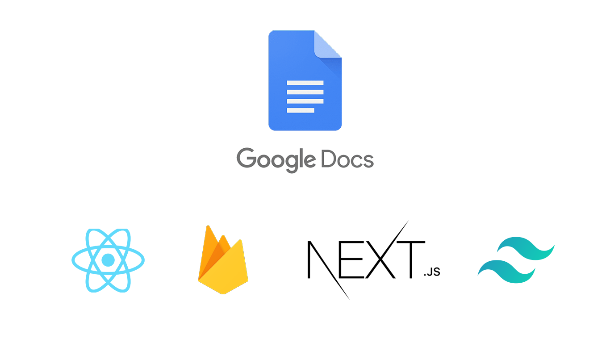

# Google Docs Clone

Built with [Next.js](https://nextjs.org/), [Firebase](https://firebase.google.com/) and [Tailwind CSS](https://tailwindcss.com/) and deployed on [Vercel](https://vercel.com/)

 

**Features**
* Document gets saved automatically in realtime
* Login using Google
* Server-side Rendering (SSR)
* Rich text editor
* Responsive Design
* Material Design

 

